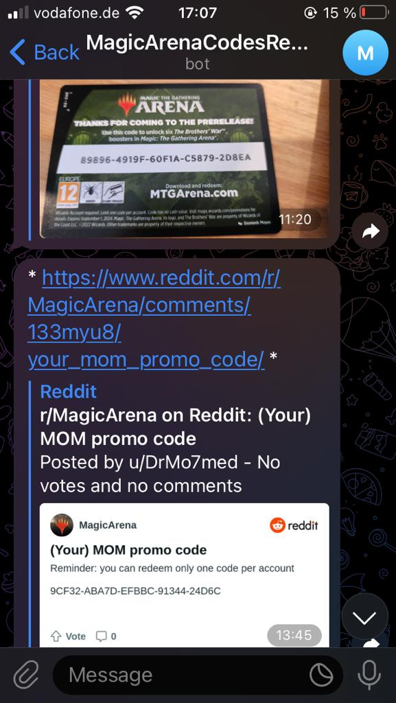
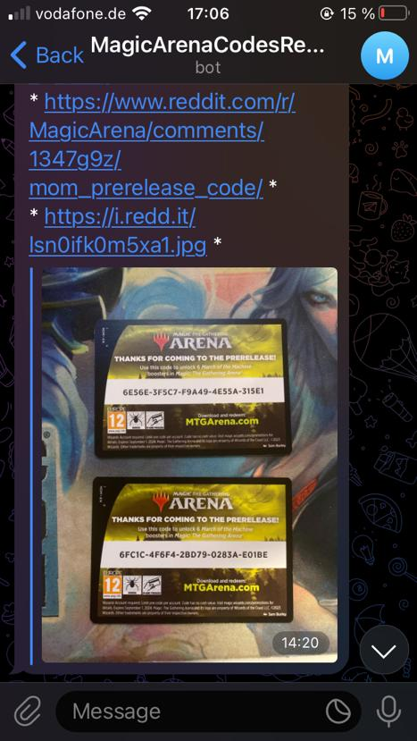

# redditMTGCodeScrapper

## A script for getting redeemable codes posted on the Magic Arena subreddit and sent to your mobile phone

short description and 
highlight what it does?
* Creating a Telegram bot
* Making use of pyhton framework to scrape the MTG Arena subreddit "New" section
* Using python framework to send the scrapped codes to your Telegram bot
* Scheduling the script in cron 


## visual help?

## How to setup the script
explanation

* Clone the repository
* Setup of environment <br />
```conda create -n python=3.11.3 redditMTGCodeScrapper pip```<br />
```pip install -r requirements.txt```
* Fill in required information

* Setup of ```cron``` to schedule script <br />
In terminal: ```crontab -e``` <br />

```*/1 * * * * cd <path-to-project-directory> && source <path-to-conda-activate-file> <environment-name>; <path-to-conda-python> <path-to-reddit-scrapper.py-file>```

Example: <br />
```*/1 * * * * cd /home/chris/Workspace/redditMTGCodeScrapper && source /home/chris/anaconda3/bin/activate redditMTGCodeScrapper; /home/chris/anaconda3/envs/redditMTGCodeScrapper/bin/python /home/chris/Workspace/redditMTGCodeScrapper/reddit_scrapper.py```

## Dependencies
* pandas==2.0.1
* praw==7.7.0
* Requests==2.29.0

##  Endresult
 
